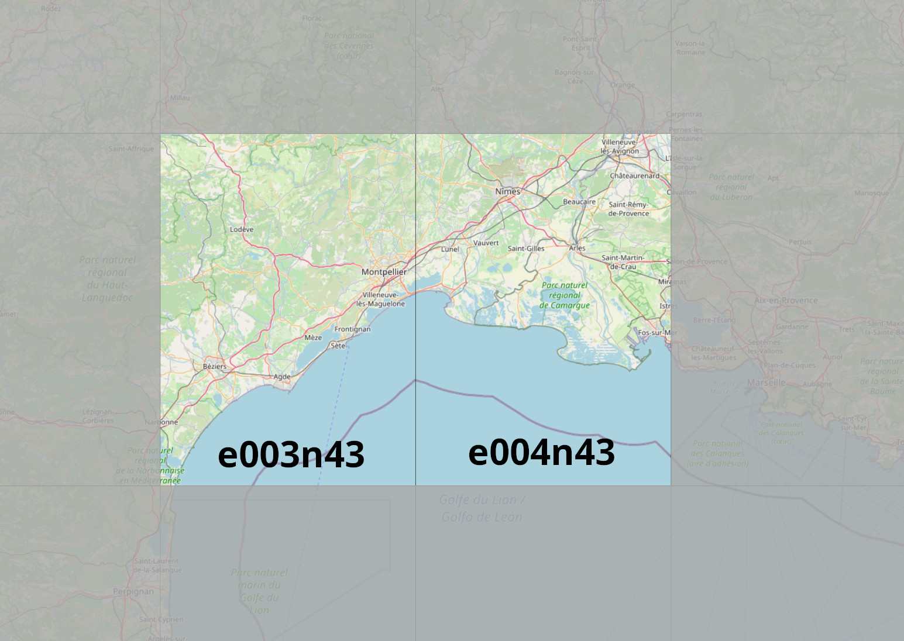

# Montpellier-custom-scenery
Montpellier custom scenery for FlightGear flight simulator

### This package contains:

*  Montpellier/Mediterranee (LFMT)
	* upgraded airport layout
	* updated ILS
	* TODO: FMS procedures
	* TODO: Customized main buildings
* Candillargues (LFNG)
	* new airport layout
* Nimes Courbessac (LFME)
	* upgraded airport layout
* Nimes Garons (LFTW)
	* upgraded airport layout
* Saint Martin de Londres (LFNL)
	* upgraded airport layout
* [closed] Nizas (LFNP)
	* upgraded airport layout
* Beziers Cap d'Agde (LFMU)
	* upgraded airport layout
* Bedarieux la Tour sur Orb (LFNX)
	* upgraded airport layout
* Millau Larzac (LFCM)
	* upgraded airport layout
* Narbonne (LFNN)
	* upgraded airport layout
* Istres Le Tube (LFMI)
	* upgraded airport layout
* Le Mazet de Romanin (LFNZ)
	* upgraded airport layout
* Avignon Caumont (LFMV)
	* upgraded airport layout
* Avignon Pujaut (LFNT)
	* upgraded airport layout
* osm2city converage (requires disc space and framerate)

### Covered area:

        
### Requirements:

* latest set of shared objects:
	http://flightgear.sourceforge.net/scenery/Models/
        
### Data sources:

* SRTM-3 global elevation data:
	http://viewfinderpanoramas.org/Coverage%20map%20viewfinderpanoramas_org3.htm
* CORINE landcover data:
	https://land.copernicus.eu/pan-european/corine-land-cover/clc2018?tab=mapview
* OSM landmass data:
	https://osmdata.openstreetmap.de/data/land-polygons.html
* x-Plane detailed airports:
	https://gateway.x-plane.com
* FlightGear terrasync objects:
	https://scenery.flightgear.org/
* FMS-procedures hosted by pinto:
	https://github.com/l0k1/fg-navaiddata
* osm2city:
	https://gitlab.com/osm2city
* osm raw data:
	https://download.geofabrik.de/

### Special thanks to:

* d-laser (https://github.com/mherweg/d-laser-fgtools)
    
    
Sven Seipp, July 2021
